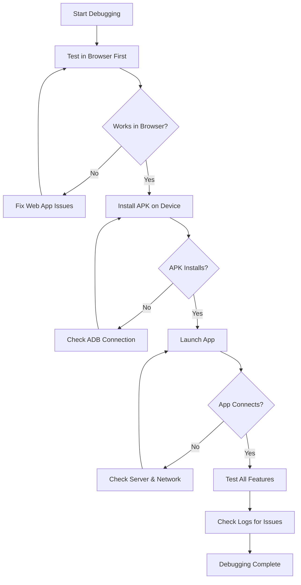

# 🐛 SmartRecipes APK Debugging Guide

## 🎯 **Quick Start Debugging**

### Option 1: Browser Testing (Easiest)
```bash
# Terminal 1: Start Flask server
python app.py

# Terminal 2: Open mobile simulation
start chrome --user-agent="Mozilla/5.0 (Linux; Android 11; Pixel 5) AppleWebKit/537.36" http://localhost:5000
```

### Option 2: Device Installation
```bash
# Connect Android device via USB
# Enable Developer Options > USB Debugging
adb install android\app\build\outputs\apk\debug\app-debug.apk
```

---

## 🛠️ **Debugging Methods**

### 1. 📱 **Physical Device Debugging**

#### Prerequisites:
- Android device with USB debugging enabled
- USB cable connection
- ADB drivers installed

#### Steps:
```bash
# Check if device is connected
adb devices

# Install debug APK
adb install -r android\app\build\outputs\apk\debug\app-debug.apk

# View logs from device
adb logcat | findstr "SmartRecipes"

# View Chrome logs (if app uses WebView)
adb logcat | findstr "chromium"
```

#### Chrome DevTools (Remote Debugging):
1. Connect device via USB
2. Enable USB debugging on device
3. Open Chrome on PC → `chrome://inspect`
4. Install and open SmartRecipes app on device
5. App appears under "Remote Target" → Click "Inspect"

---

### 2. 🌐 **Browser Debugging**

#### Test Your Web App First:
```bash
# Start Flask server
python app.py

# Open in browser with mobile simulation
chrome --user-agent="Mozilla/5.0 (Linux; Android 11; Pixel 5) AppleWebKit/537.36" http://localhost:5000
```

#### Browser DevTools:
- **F12** → Developer Tools
- **Ctrl+Shift+M** → Mobile device simulation
- **Console** tab → View JavaScript errors
- **Network** tab → Check API calls
- **Application** tab → Check service worker, storage

---

### 3. 📊 **Log Analysis**

#### View APK Logs:
```bash
# All app logs
adb logcat | findstr "SmartRecipes"

# JavaScript errors
adb logcat | findstr "Console"

# Network issues
adb logcat | findstr "XMLHttpRequest\|fetch"

# WebView errors
adb logcat | findstr "WebView\|chromium"
```

#### Flask Server Logs:
```bash
# Start server with debug mode
python app.py
# Check terminal output for requests and errors
```

---

### 4. 🔍 **APK Analysis**

#### Check APK Contents:
```bash
# View APK info (if Android SDK tools available)
aapt dump badging android\app\build\outputs\apk\debug\app-debug.apk

# View permissions
aapt dump permissions android\app\build\outputs\apk\debug\app-debug.apk
```

#### APK Size Analysis:
```bash
# Check file sizes
dir android\app\build\outputs\apk\debug\
```

---

## 🚨 **Common Issues & Solutions**

### Issue 1: App Won't Connect to Server
**Symptoms**: App shows "Unable to connect to server"

**Debug Steps**:
1. Check if Flask server is running: `python app.py`
2. Test in browser: `http://localhost:5000`
3. Check network on device (WiFi connected?)
4. Verify server URLs in `index.html`

**Fix**:
```javascript
// Update server URLs in index.html
this.serverUrls = [
    'http://192.168.1.XXX:5000',  // Replace with your PC's IP
    'http://localhost:5000',
    'http://127.0.0.1:5000'
];
```

### Issue 2: App Crashes on Launch
**Debug Steps**:
```bash
# View crash logs
adb logcat | findstr "FATAL\|AndroidRuntime"

# Check for permission issues
adb logcat | findstr "Permission"
```

### Issue 3: WebView Not Loading
**Debug Steps**:
```bash
# Check WebView logs
adb logcat | findstr "WebView\|chromium"

# Test URL directly in device browser
```

### Issue 4: JavaScript Errors
**Debug Steps**:
- Use Chrome DevTools remote debugging
- Check browser console for errors
- Test in mobile browser first

---

## 🔧 **Advanced Debugging**

### Enable Verbose Logging:
```bash
# Build with detailed logs
cd android
.\gradlew assembleDebug --info --debug
```

### Custom Log Statements:
Add to your `index.html`:
```javascript
// Add debug logging
console.log('[SmartRecipes] Starting app initialization...');
console.log('[SmartRecipes] Server URLs:', this.serverUrls);
console.log('[SmartRecipes] Connection status:', status);
```

### Network Debugging:
```javascript
// Add to index.html for network debugging
fetch(testUrl, { 
    method: 'GET',
    mode: 'no-cors',
    timeout: this.connectionTimeout 
})
.then(response => {
    console.log('[SmartRecipes] Network response:', response.status);
})
.catch(error => {
    console.error('[SmartRecipes] Network error:', error);
});
```

---

## 📋 **Debugging Checklist**

### Before Testing:
- [ ] Flask server is running (`python app.py`)
- [ ] Web app works in browser (`http://localhost:5000`)
- [ ] Device has USB debugging enabled
- [ ] Device is connected (`adb devices`)

### During Testing:
- [ ] APK installs without errors
- [ ] App launches successfully
- [ ] Network connectivity works
- [ ] All features function properly

### After Testing:
- [ ] Check logs for errors (`adb logcat`)
- [ ] Test on different devices/Android versions
- [ ] Verify performance and responsiveness

---

## 🎯 **Debugging Workflow**



---

## 🛠️ **Quick Debug Commands**

```bash
# All-in-one debug session
debug-apk.bat              # Use the interactive debug menu

# Manual debugging
python app.py              # Start server
adb devices                # Check device connection
adb install -r android\app\build\outputs\apk\debug\app-debug.apk
adb logcat | findstr "SmartRecipes"  # View logs
```

**Your debug environment is ready! Start with the `debug-apk.bat` script for an interactive debugging experience. 🎊**
